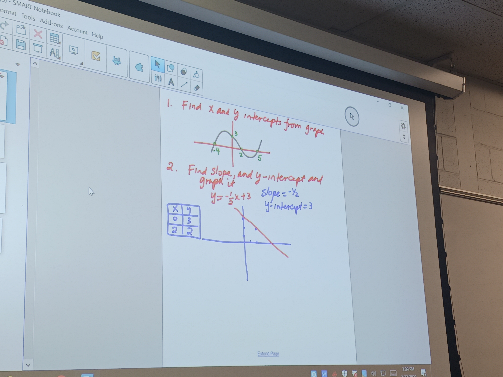
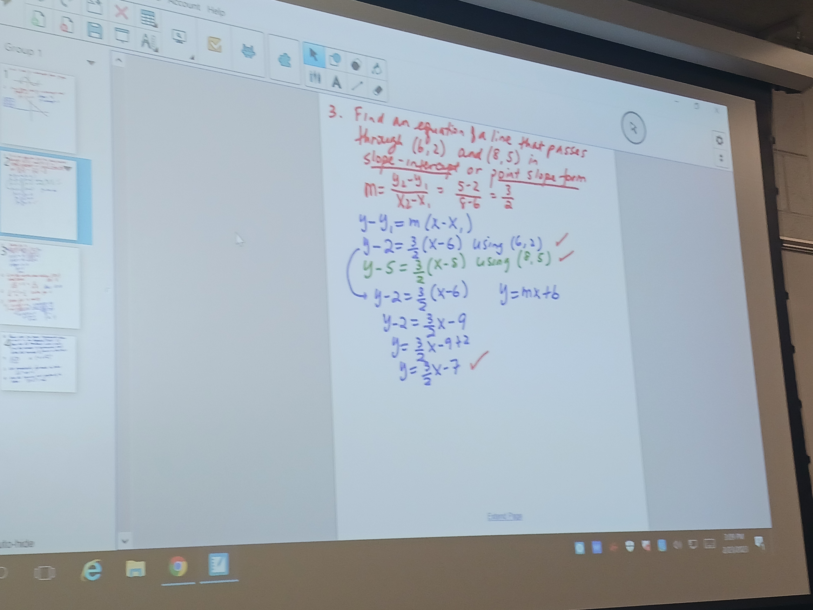
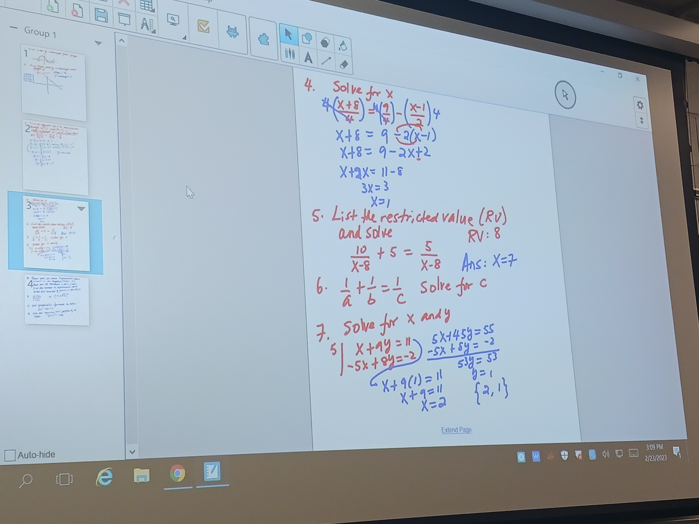
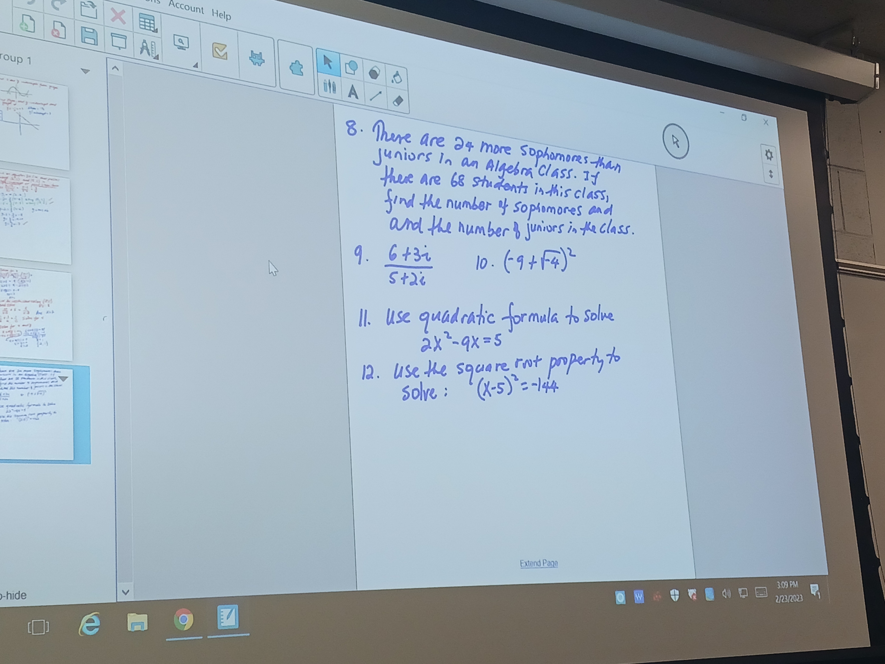
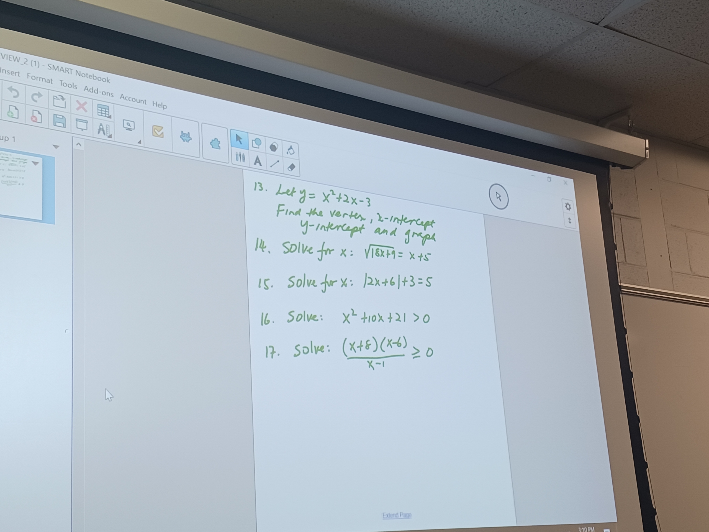

# Lesson 1 #
### March 8, 2023 ###

## Problems ##
1. Find the $x$ and $y$ intercepts from the graph.
2. Find the slope and $y$-intercept: $y = -\frac{1}{2}x + 3$. Graph the line.
3. Find an equation for a line that passes through $(6, 2)$ and $(8, 5)$ in *slope intercept* and *point-slope form*.
4. Solve for $x$: $$\frac{x + 8}{4} = \frac{9}{4} - \frac{x - 1}{2}$$
5. List the restricted value (RV) and solve: $$\frac{10}{x - 8} + 5 = \frac{5}{x - 8}$$
6. Solve for $c$: $$\frac{1}{a} + \frac{1}{b} = \frac{1}{c}$$
7. Solve for $x$ and $y$: $$x + 9y = 11$$ $$-5x + 8y = -2$$
8. There are 24 more sophomores than juniors in an algebra class. If there are 68 students in this class, find the number of sophomores and the number of juniors in the class.
9. $\frac{6 + 3i}{5 + 2i}$
10. $(-9 + \sqrt{-4})^2$
11. Use the quadratic formula to solve $2x^2 - 9x = 5$
12. Use the square root property to solve $(x - 5)^2 = -144$
13. Let $y = x^2 + 2x - 3$. Find the vertex, $x$-intercept, $y$-intercept, and graph.
14. Solve for $x$: $$\sqrt{18x + 9} = x + 5$$
15. Solve for $x$: $$|2x + 6| + 3 = 5$$
16. Solve for $x$: $$x^2 + 10x + 21 > 0$$
17. Solve for $x$: $$\frac{(x + 8)(x - 6)}{x - 1} \geq 0$$

## Reference ##
### Picture 1 ###

### Picture 2 ###

### Picture 3 ###

### Picture 4 ###

### Picture 5 ###
